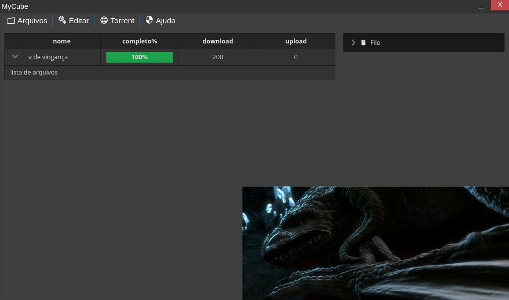

# Projeto MyCube
  
  
  
  Projeto Desktop em electron e react, com a implementação do webtorrent em electron
 para criar uma player de video que baixa videos em torrent e os reproduz
 
 ## Execução( Build )
 Utilize o npm para compilar o programa
```
 npm start # para abrir no browser
 npm build # gerar os arquivos react do programa
```
## Bibliotecas

* [WebTorrent](https://webtorrent.io) - Cliente torrent de streaming
* [React](https://pt-br.reactjs.org) - biblioteca JavaScript para criar interfaces de usuário
* [PrimeReact](https://www.primefaces.org/primereact/) - Biblioteca de components para agilizar

